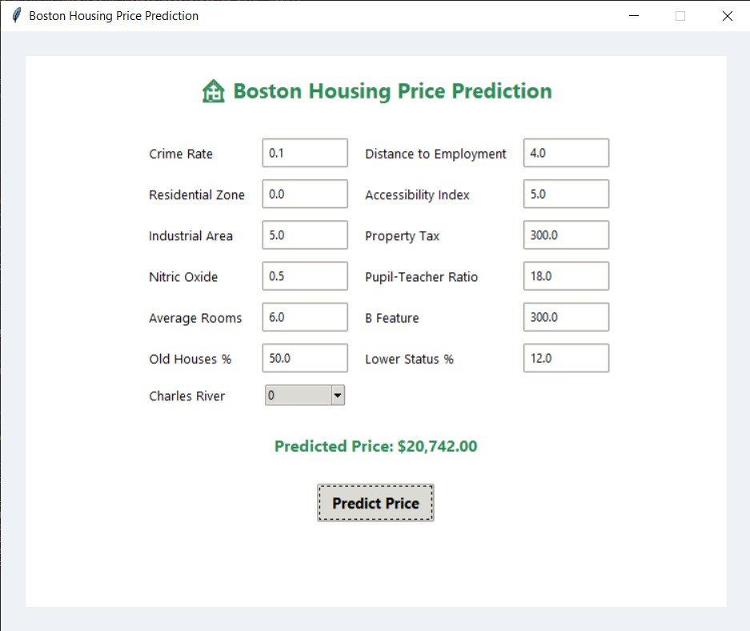
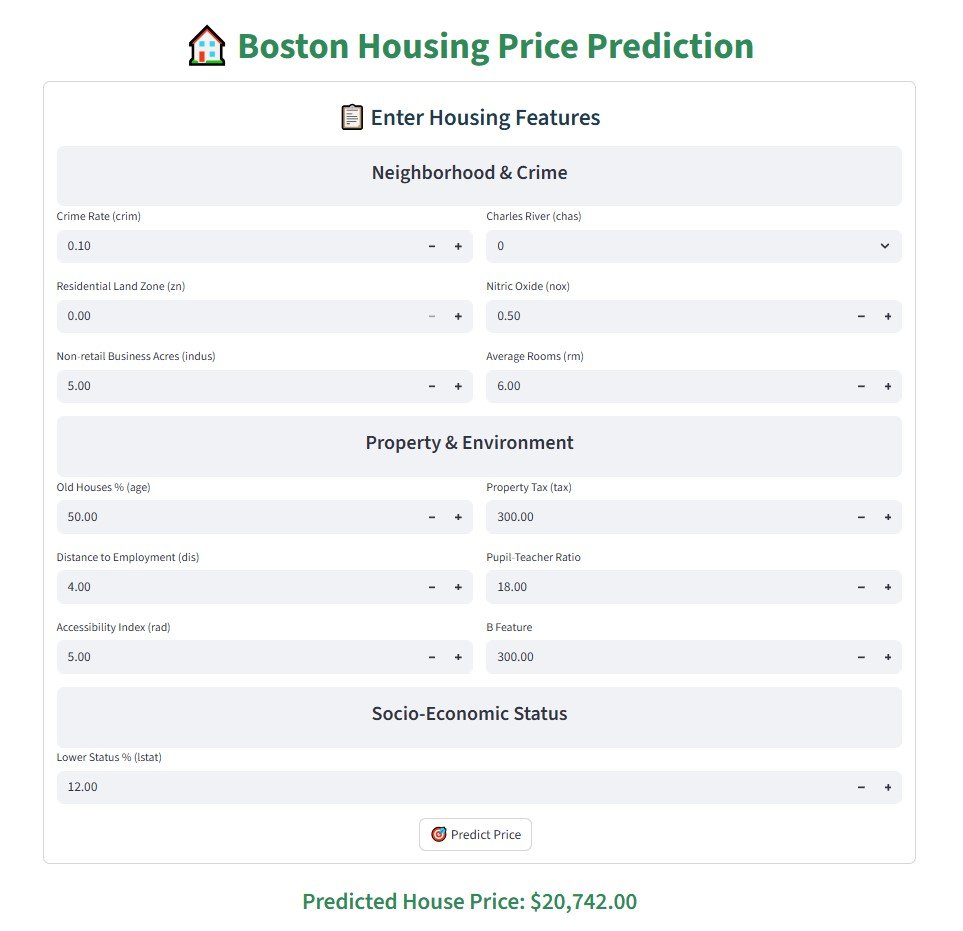

---

# 🏠 Boston Housing Price Prediction App

This project aims to predict the housing prices in Boston using various machine learning techniques, including linear regression, decision trees, with both **Streamlit Web GUI** and **Tkinter Desktop GUI**.

---

##  Project Overview

This project applies Machine Learning to predict housing prices using the Boston Housing dataset.
The application includes:

*  Model Training & Evaluation
*  Visualization (R², RMSE, Cross-Validation, ROC if applicable)
*  Desktop GUI (Tkinter)
*  Web App (Streamlit)
*  Model Serialization & Deployment Ready

---

##  Machine Learning Pipeline

* Data Preprocessing & Scaling
* Model Training:

  * Linear Regression
  * Decision Tree
  * Random Forest
* Cross-Validation
* Best Model Selection
* Model Saving using Joblib

---

##  Best Model Selection

The best model is selected based on:

```
R² - Normalized RMSE
```

Ensuring both performance and stability.

---

#  Desktop Application (Tkinter GUI)

###  Features:

* Modern Gradient Background
* Clean Card-Based Layout
* Input Validation
* Real-Time Prediction
* Professional UI Design

###  Desktop GUI Screenshot



---

#  Web Application (Streamlit)

###  Features:

* Interactive Form
* Clean Layout
* Model Prediction Display
* Easy Deployment

###  Streamlit GUI Screenshot



---

#  Project Structure

```
Boston-Housing-App/                     # Root folder for the project
│
├── data/                               # Folder to store datasets
│   └── BostonHousing.csv               # Raw data from the Boston Housing Dataset
│
├── models/                             # Folder for trained ML models
│   ├── best_model.pkl                  # Pickle file for best performing model (Random Forest)
│   └── scaler.pkl                      # Pickle file for data scaler used in preprocessing
│
├── images/                             # Folder to store screenshots / GUI images
│   ├── Streamlit-GUI.jpg               # Screenshot of Streamlit GUI
│   └── Tkinter-GUI.jpg                 # Screenshot of Tkinter GUI
│
├── notebooks/                          # Jupyter notebooks for experimentation & model training
│   └── housing-price-prediction.ipynb  # Notebook showing data exploration, preprocessing, model training
│
├── GUI/                                # Folder containing GUI scripts
│   ├── Streamlit-GUI.py                # Streamlit frontend app
│   └── Tkinter-GUI.py                  # Tkinter frontend app
│
├── housing-price-prediction.py         # Main Python script for running predictions (optional if using GUIs)
├── requirements.txt                    # List of Python dependencies (numpy, pandas, scikit-learn, etc.)
└── README.md                           # Project documentation with instructions, screenshots, and usage
```
---

# ⚙ Installation

```bash
git clone https://github.com/ahmed-morad15/Boston-Housing-App.git
cd Boston-Housing-App
pip install -r requirements.txt
```

---

#  Run Desktop App

```bash
python Tkinter-GUI.py
```

---

#  Run Streamlit App

```bash
streamlit run Streamlit-GUI.py
```

---

# 🛠 Technologies Used

* Python
* Scikit-learn
* Pandas
* NumPy
* Matplotlib
* Seaborn
* Streamlit
* Tkinter

---

#  Model Performance Example

| Model             | R² Score | RMSE |
| ----------------- | -------- | ---- |
| Linear Regression | 0.72     | 4.68 |
| Decision Tree     | 0.80     | 3.91 |
| Random Forest     | 0.87     | 3.12 |

---

#  Author

**Ahmed Morad**<br>
Machine Learning Engineer | AI & Data Science

---
