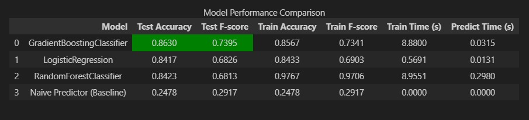

---

# Finding Donors for CharityML

This project applies supervised machine learning techniques to identify individuals most likely to donate to charity based on census data.

---

### Install

This project requires **Python 3.x** and the following Python libraries installed:

* NumPy
* Pandas
* Matplotlib
* scikit-learn
* Jupyter Notebook

You will also need software installed to run and execute a **Jupyter Notebook**.

We recommend installing **Anaconda**, which provides a pre-packaged Python distribution containing all necessary libraries and tools for this project.

---

# Project Structure

```
finding_donors/
│
├── finding_donors.ipynb     # Main notebook containing data analysis and model training
├── visuals.py               # Visualization helper functions
├── census.csv               # Dataset used for training and evaluation
├── models/
│   └── best_gradient_boosting_model.pkl   # Saved trained model
├── images/
│   └── results.png          # Screenshot of model results
│
└── README.md                # Project documentation
```

---

# Workflow

The project workflow follows these main steps:

1. **Data Exploration**
   Understanding the census dataset and identifying important features.

2. **Data Preprocessing**
   Handling categorical variables, scaling numerical features, and preparing the dataset for modeling.

3. **Model Training**
   Training multiple supervised learning models:

   * GradientBoostingClassifier
   * LogisticRegression
   * RandomForestClassifier

4. **Model Evaluation**
   Evaluating models using:

   * Accuracy
   * F-score (β = 0.5)

5. **Hyperparameter Tuning**
   Using GridSearchCV to optimize the best-performing model.

6. **Final Model Selection**
   Selecting the model with the best predictive performance.

---

### Code

Template code is provided in the `finding_donors.ipynb` notebook file.

The project also uses:

* `visuals.py` for data visualizations
* `census.csv` as the dataset

Some code is already implemented to help start the project, but additional functionality must be implemented to complete the analysis and modeling tasks.

The machine learning models used in this project include:

* GradientBoostingClassifier
* LogisticRegression
* RandomForestClassifier

These models are evaluated using **Accuracy** and **F-score**.

---

### Run

In a terminal or command window, navigate to the project directory `finding_donors/` and run:

```bash
jupyter notebook finding_donors.ipynb
```

This will open the notebook in your browser where you can run the analysis and models.

---

# Data

The modified census dataset contains approximately **32,000 samples** with **13 features** describing demographic and employment information.

The dataset is derived from the UCI Machine Learning Repository and was originally published in the paper:

*"Scaling Up the Accuracy of Naive-Bayes Classifiers: a Decision-Tree Hybrid"*
by Ron Kohavi.

---

# Features

* `age`: Age
* `workclass`: Type of employer
* `education_level`: Education level
* `education-num`: Number of years of education
* `marital-status`: Marital status
* `occupation`: Job type
* `relationship`: Family relationship status
* `race`: Race
* `sex`: Gender
* `capital-gain`: Capital gains
* `capital-loss`: Capital losses
* `hours-per-week`: Weekly working hours
* `native-country`: Country of origin

---

# Target Variable

`income`

Possible values:

* `<=50K` → Income less than or equal to $50K
* `>50K` → Income greater than $50K

The goal of the project is to **predict whether an individual earns more than $50K per year**.

---

# Model Comparison

Three supervised learning models were trained and evaluated on the test dataset:

| Model                      | Test Accuracy | Test F-score |
| -------------------------- | ------------- | ------------ |
| GradientBoostingClassifier | 0.863         | 0.739        |
| LogisticRegression         | 0.841         | 0.683        |
| RandomForestClassifier     | 0.842         | 0.681        |

---

# Results Visualization

Below is a snapshot of the model performance and comparison:



---

# Best Model

The best performing model was **GradientBoostingClassifier**.
It achieved the highest F-score, which is the primary evaluation metric for this problem.

After applying **GridSearchCV hyperparameter tuning**, the optimized model achieved improved performance and became the final model used for prediction.

Evaluation metrics used:

* Accuracy
* F-score (β = 0.5)

---

# Feature Importance

The most important features for predicting income include:

* Capital Gain
* Education Level
* Age
* Hours per Week
* Occupation

These features were identified as the most influential by the trained model.

---

# Model Saving

The final optimized model is saved using Python serialization so it can be reused without retraining.

Example:

```python
import pickle

with open("models/best_gradient_boosting_model.pkl", "wb") as f:
    pickle.dump(best_clf, f)
```

---

# Conclusion

This project demonstrates how supervised learning models can be used to analyze demographic data and predict income levels.

By comparing multiple models and applying hyperparameter tuning, the final model achieves strong predictive performance and helps identify individuals who are more likely to donate to charity.

---

# Author

Ahmed Morad
Machine Learning Engineer

---
