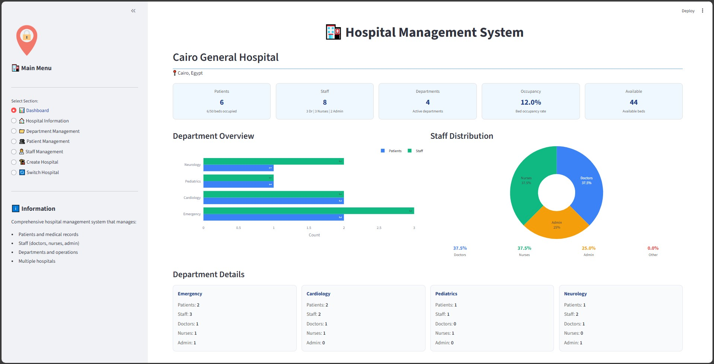

# 🏥 Hospital Management System

A **professional, modular, and extensible Hospital Management System** built with **Python** following solid **Object-Oriented Programming (OOP)** principles. The project provides both a **Console-Based Interface** and a **modern Streamlit Web Dashboard**, making it suitable for academic projects, demonstrations, and real-world system design practice.

---

## ✨ Key Highlights

* Dual Interface: **Console + Web GUI**
* Clean OOP architecture with clear separation of concerns
* Multi-hospital support
* Role-based staff management (Doctors, Nurses, Admins)
* Interactive Streamlit dashboard
* Scalable and future-ready design

---

## 📋 Dual Interface Architecture

### 🖥️ Console Interface

A classic command-line interface that allows full system control via structured menus. Ideal for learning OOP design, testing logic, and running the system in low-resource environments.

### 🌐 Streamlit Web Interface

A modern, user-friendly dashboard built with **Streamlit**, offering:

* Visual metrics and summaries
* Interactive forms and workflows
* Sidebar-based navigation
* Professional UI suitable for demos and presentations

📸 **Dashboard Preview**



---

## 🏥 System Overview

The Hospital Management System handles core hospital operations, including:

* Patient registration and admission
* Department and staff organization
* Doctor-patient assignments
* Medical record tracking
* Administrative and reporting operations

The system supports **multiple hospitals**, each operating independently under a unified management layer.

---

## 🧩 UML Design

The system is designed using UML-driven development to ensure clarity, scalability, and maintainability.


---

## 🚀 Core Features

### 🏛️ Hospital Management

* Create and manage multiple hospitals
* Switch seamlessly between hospital contexts
* View hospital-wide statistics and summaries
* Track departments, patients, and staff

### 🏥 Department Management

* Create and remove medical departments
* Assign patients and staff to departments
* Monitor department occupancy and activity
* Department-specific views and operations

### 👨‍⚕️ Staff Management

* **Doctors**: specialization, license number, patient capacity
* **Nurses**: experience level, ward assignment
* **Admin Staff**: access levels and administrative control
* **General Staff**: basic operational roles

### 👥 Patient Management

* Register new patients
* Admit and discharge workflows
* Department transfers
* Medical record storage and viewing
* Assign patients to doctors

### 📊 Operations & Reporting

* Prescription handling
* Surgery scheduling
* Appointment processing
* Inventory management
* Report generation

---

## 🗂️ Project Structure

```
hospital_management_system/
├── __init__.py
├── main.py                    # Console application entry point
├── app.py                     # Streamlit Web GUI
├── README.md                  # Project documentation
├── core/                      # Core business logic
│   ├── __init__.py
│   ├── hospital.py            # Hospital entity
│   ├── department.py          # Department logic
│   └── hospital_manager.py    # Multi-hospital controller
├── models/                    # Data models
│   ├── __init__.py
│   ├── person.py              # Base Person class
│   ├── patient.py             # Patient model
│   ├── staff.py               # Base Staff class
│   ├── doctor.py              # Doctor specialization
│   ├── nurse.py               # Nurse specialization
│   └── admin_staff.py         # Administrative staff
└── requirements.txt           # Python dependencies
```

---

## 🔧 Installation & Setup

### Prerequisites

* Python **3.8+**
* pip (Python Package Manager)

### Installation Steps

1️⃣ **Clone the repository**

```bash
git clone <repository-url>
cd hospital_management_system
```

2️⃣ **Install dependencies**

```bash
pip install -r requirements.txt
```

3️⃣ **Run Console Version**

```bash
python main.py
```

4️⃣ **Run Streamlit Web Application**

```bash
streamlit run app.py
```

---

## 🧬 Class Architecture

### Inheritance Hierarchy

```
Person
├── Patient
└── Staff
    ├── Doctor
    ├── Nurse
    └── AdminStaff
```

### Key Class Responsibilities

* **Person**: Base class for all individuals
* **Patient**: Medical records, admission, discharge
* **Staff**: Department assignment and role handling
* **Doctor**: Specialization, licensing, patient care
* **Nurse**: Ward assignment and patient monitoring
* **AdminStaff**: Reports, appointments, inventory

---

## 💡 Design Principles

* Object-Oriented Programming (OOP)
* Single Responsibility Principle (SRP)
* Separation of UI and business logic
* Scalable architecture for future expansion

---

## 🔮 Future Roadmap

### Phase 2 – Persistence & Automation

* [ ] Database integration (SQLite / PostgreSQL)
* [ ] Appointment scheduling system
* [ ] Billing and payment module
* [ ] Pharmacy inventory tracking

### Phase 3 – Web & API

* [ ] RESTful API (Flask / FastAPI)
* [ ] Authentication & role-based access
* [ ] Full-stack web deployment
* [ ] Mobile-friendly UI

### Phase 4 – AI & Advanced Features

* [ ] Machine learning for patient risk prediction
* [ ] AI-powered diagnostics support
* [ ] Medical device integration
* [ ] Telemedicine services

---

## 🏆 Credits & Metadata

* **Developer**: Ahmed Morad
* **Version**: 1.0.0
* **Last Updated**: January 2026
* **Project Type**: Training 

---

## 🔗 References & Resources

* [Python Official Documentation](https://docs.python.org/3/)
* [OOP Concepts in Python](https://realpython.com/python3-object-oriented-programming/)
* [Hospital Management Best Practices](https://www.who.int/healthsystems/en/)
* [Medical Software Standards](https://www.iso.org/standard/67868.html)
* [Streamlit Documentation](https://docs.streamlit.io/)
* [Plotly Python Graphing Library](https://plotly.com/python/)

---